# AI Recruitment Platform

An AI-powered recruitment platform that streamlines the hiring process using Resume Parsing, Semantic Search, ATS Evaluation, AI Candidate Insights, and Intelligent Candidate Ranking.

The platform provides dedicated dashboards for **Candidates** and **Recruiters**, enabling an efficient end-to-end recruitment workflow powered by Artificial Intelligence.

---

## Features

### Candidate Module

- User Registration & Login
- Upload Resume (PDF/DOC/DOCX)
- AI Resume Parsing
- Resume Analysis
- Browse Available Jobs
- Search Jobs
- Apply for Jobs
- Track Application Status
- Candidate Dashboard

### Recruiter Module

- Recruiter Registration & Login
- Recruiter Dashboard
- Create, Edit & Delete Jobs
- View Applicants
- Update Application Status
- AI Candidate Insights
- Recruitment Analytics Dashboard
- Semantic Candidate Search
- ATS Evaluation & Candidate Ranking

---

## AI Features

- Resume Parsing
- Skill Extraction
- Semantic Search
- Resume Embeddings
- Hybrid Candidate Matching
- ATS Score Calculation
- AI Candidate Insights using Google Gemini
- Intelligent Candidate Ranking
- Recruitment Analytics

---

## Tech Stack

### Frontend

- React
- TypeScript
- Vite
- Tailwind CSS
- React Router
- Axios
- Lucide React
- Recharts
- Sonner

### Backend

- FastAPI
- SQLAlchemy
- PostgreSQL
- Alembic
- Pydantic

### AI & Machine Learning

- Sentence Transformers
- Qdrant Vector Database
- Google Gemini API
- Hybrid Search
- Semantic Search

---

# Project Structure

```
resume-screening-system
│
├── backend
│   ├── app
│   ├── alembic
│   ├── requirements.txt
│   └── .env
│
├── frontend
│   ├── src
│   ├── public
│   ├── package.json
│   └── vite.config.ts
│
├── screenshots
│   ├── landing-page.png
│   ├── candidate-dashboard.png
│   ├── resume-management.png
│   ├── browse-jobs.png
│   ├── applications.png
│   ├── recruiter-dashboard.png
│   ├── manage-jobs.png
│   ├── ai-insights.png
│   ├── analytics.png
│   ├── ats-evaluation.png
│   └── semantic-search.png
│
└── README.md
```

---

# Installation

## Clone Repository

```bash
git clone <repository-url>
cd resume-screening-system
```

---

# Backend Setup

### Create Virtual Environment

```bash
python -m venv .venv
```

### Activate Environment

#### Windows

```bash
.venv\Scripts\activate
```

#### Linux / macOS

```bash
source .venv/bin/activate
```

### Install Dependencies

```bash
pip install -r requirements.txt
```

### Configure Environment Variables

Create a `.env` file inside the backend directory.

Example:

```env
DATABASE_URL=

SECRET_KEY=

ALGORITHM=HS256

ACCESS_TOKEN_EXPIRE_MINUTES=60

GEMINI_API_KEY=

QDRANT_URL=

QDRANT_API_KEY=

COLLECTION_NAME=
```

### Run Database Migration

```bash
alembic upgrade head
```

### Start Backend

```bash
uvicorn app.main:app --reload
```

Backend:

```
http://localhost:8000
```

Swagger API:

```
http://localhost:8000/docs
```

---

# Frontend Setup

Navigate to frontend

```bash
cd frontend
```

Install dependencies

```bash
npm install
```

Start application

```bash
npm run dev
```

Frontend:

```
http://localhost:5173
```

---

# Application Modules

## Authentication

- Candidate Registration
- Recruiter Registration
- JWT Authentication
- Secure Login

---

## Candidate

- Dashboard
- Resume Upload
- Resume Analysis
- Browse Jobs
- Search Jobs
- Apply Jobs
- Application Tracking

---

## Recruiter

- Dashboard
- Manage Jobs
- View Applicants
- AI Insights
- Recruitment Analytics
- Semantic Search
- ATS Evaluation

---

# AI Workflow

```
Resume Upload
        │
        ▼
Resume Parsing
        │
        ▼
Skill Extraction
        │
        ▼
Vector Embeddings
        │
        ▼
Qdrant Vector Database
        │
        ▼
Semantic Search
        │
        ▼
Hybrid Matching
        │
        ▼
ATS Evaluation
        │
        ▼
Gemini AI Insights
        │
        ▼
Candidate Ranking
```

---

# API Highlights

### Authentication

- Register Candidate
- Register Recruiter
- Login
- Current User

### Resume

- Upload Resume
- Parse Resume
- Analyze Resume

### Jobs

- Browse Jobs
- Create Job
- Update Job
- Delete Job

### Applications

- Apply for Job
- Candidate Applications
- Recruiter Applicants
- Update Application Status

### AI

- Semantic Candidate Search
- ATS Evaluation
- AI Candidate Insights
- Recruitment Analytics

---

# Screenshots

## Landing Page

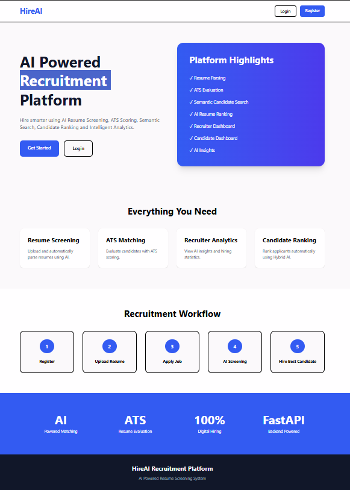

---

## Candidate Dashboard

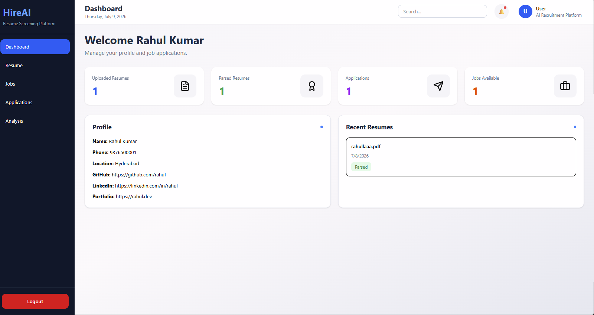

---

## Resume Management

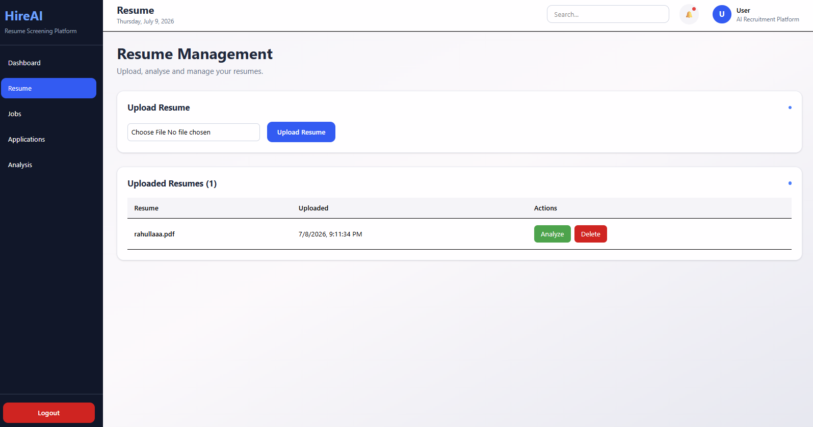

---

## Browse Jobs

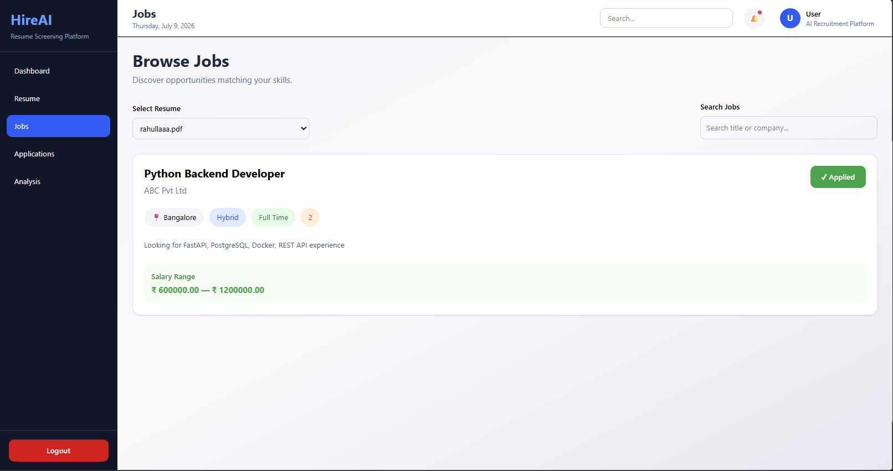

---

## Applications

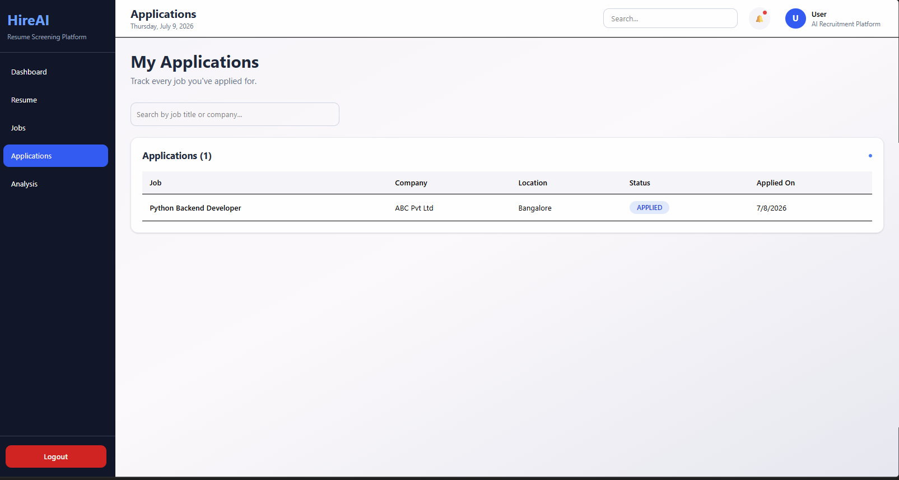

---

## Recruiter Dashboard

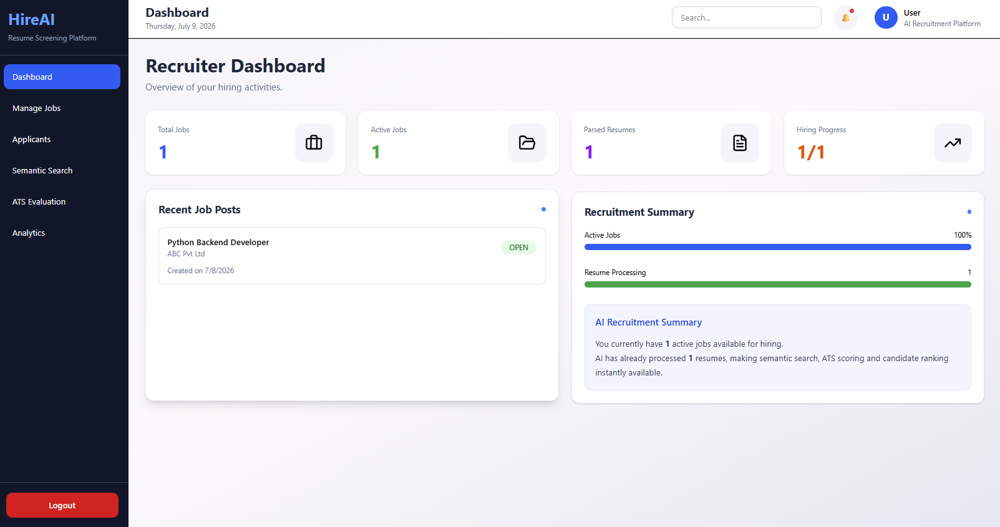

---

## Manage Jobs

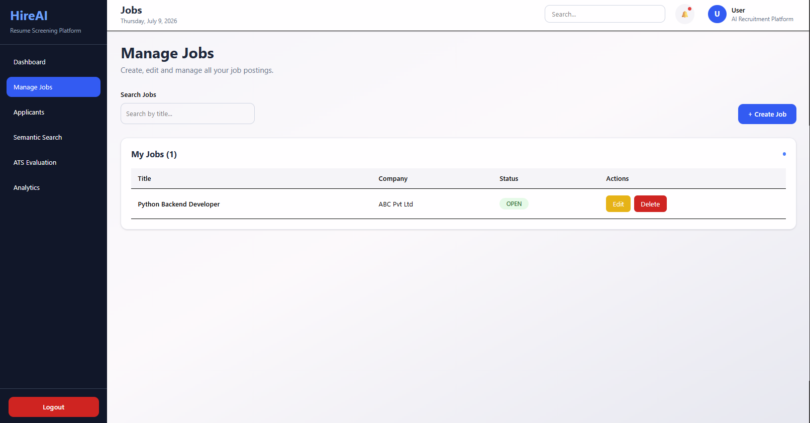

---

## Applicants & AI Insights

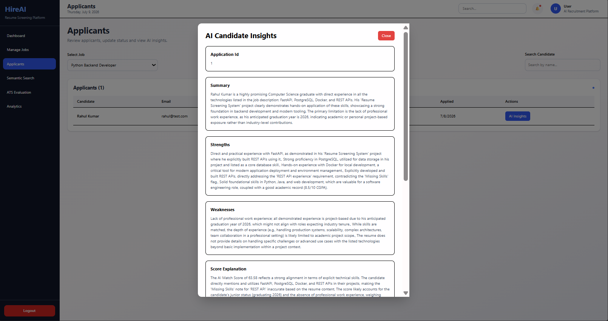
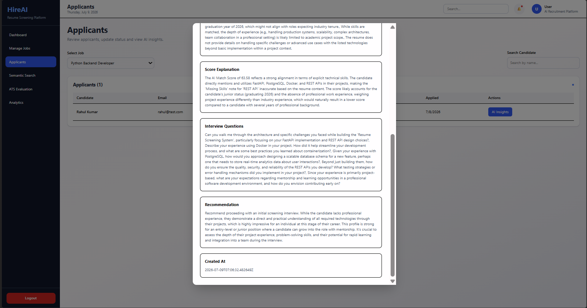

---

## Recruitment Analytics

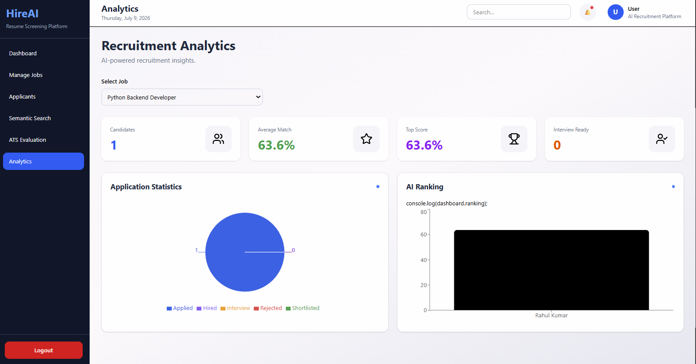

---

## ATS Evaluation

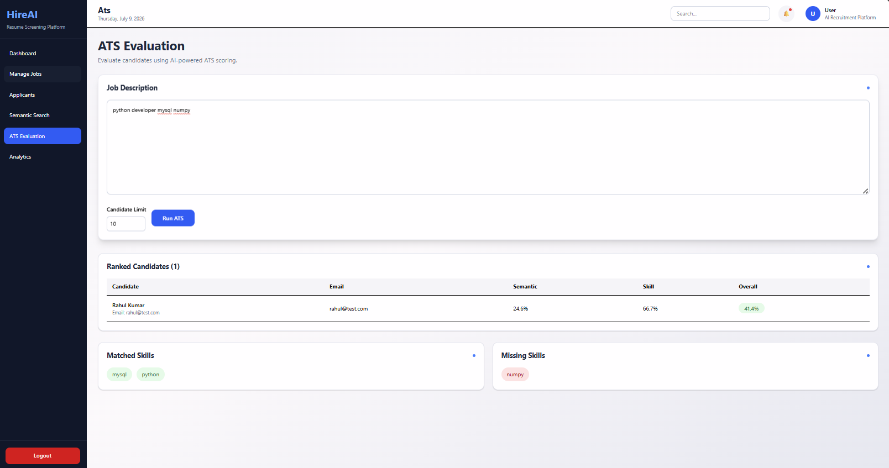

---

## Semantic Search

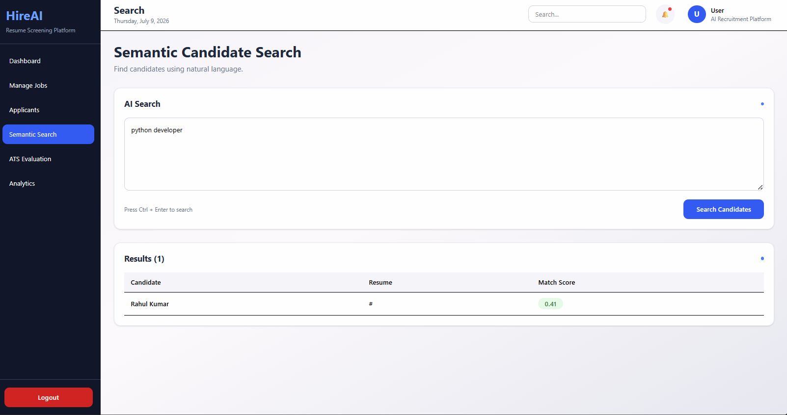

---

# Future Enhancements

- Email Notifications
- Interview Scheduling
- Resume Versioning
- Company Profiles
- Advanced Analytics
- Multi-language Resume Parsing
- Dark Mode
- Calendar Integration
- Interview Feedback Management

---

# Authors

**AI Recruitment Platform**

A Full Stack AI-powered Recruitment System developed using:

- React
- TypeScript
- FastAPI
- PostgreSQL
- SQLAlchemy
- Qdrant Vector Database
- Google Gemini AI

---

## License

This project is intended for educational and learning purposes.